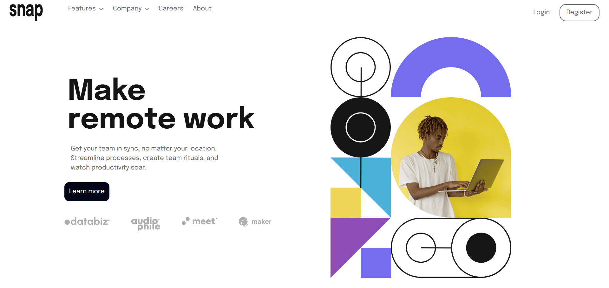

# Frontend Mentor - Intro section with dropdown navigation solution

This is a solution to the [Intro section with dropdown navigation challenge on Frontend Mentor](https://www.frontendmentor.io/challenges/intro-section-with-dropdown-navigation-ryaPetHE5). Frontend Mentor challenges help you improve your coding skills by building realistic projects.

## Table of contents

* [Overview](#overview)

  * [The challenge](#the-challenge)
  * [Screenshot](#screenshot)
  * [Links](#links)
* [My process](#my-process)

  * [Built with](#built-with)
  * [What I learned](#what-i-learned)
  * [Continued development](#continued-development)
  * [Useful resources](#useful-resources)
* [Author](#author)
* [Acknowledgments](#acknowledgments)

## Overview

### The challenge

Users should be able to:

* View the relevant dropdown menus on desktop and mobile when interacting with the navigation links
* View the optimal layout for the content depending on their device's screen size
* See hover states for all interactive elements on the page

### Screenshot



### Links

* Solution URL: [Add solution URL here](https://your-solution-url.com)
* Live Site URL: [https://intro-section-puce-gamma.vercel.app/](https://intro-section-puce-gamma.vercel.app/)

## My process

### Built with

* Semantic HTML5 markup
* Flexbox
* Mobile-first workflow
* [React](https://reactjs.org/) - JS library
* [Tailwind CSS](https://tailwindcss.com/) - Utility-first CSS framework

### What I learned

This project helped me solidify my understanding of **mobile-first responsive design** and building reusable **React components**.

I particularly learned how to structure a navigation bar with dropdown menus that adapt between desktop and mobile views.

Here’s an example of my mobile menu toggle logic:

```js
const [isMenuOpen, setIsMenuOpen] = useState(false);

const toggleMenu = () => {
  setIsMenuOpen((prev) => !prev);
};
```

### Continued development

In future projects, I want to:

* Improve accessibility by adding better keyboard navigation for dropdowns.
* Explore animations with Tailwind CSS transitions for smoother menu opening and closing.
* Implement unit tests for components.

### Useful resources

* [Tailwind CSS Documentation](https://tailwindcss.com/docs) – Helped me quickly style and make the page responsive.
* [React Docs](https://react.dev/) – Great reference for managing component state and props.

## Author

* Website - [Your Name](https://your-site.com)
* Frontend Mentor - [@boyutife](https://www.frontendmentor.io/profile/Boyutife)
* Twitter - [@boluwatife_ven](https://twitter.com/boluwatife_ven)

## Acknowledgments

Thanks to the Frontend Mentor community for providing detailed feedback and inspiration on similar projects.

---


